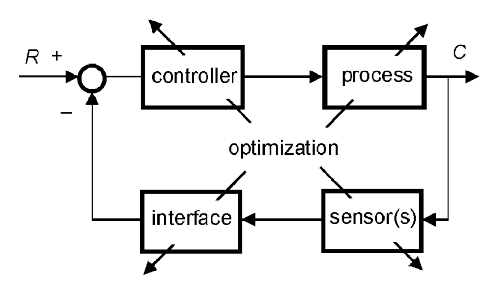
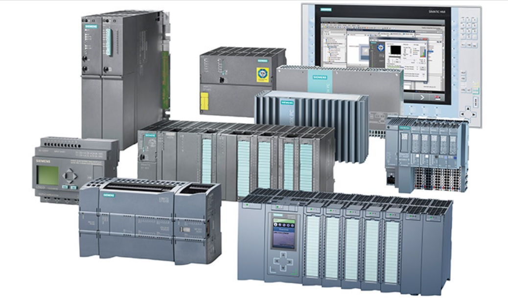
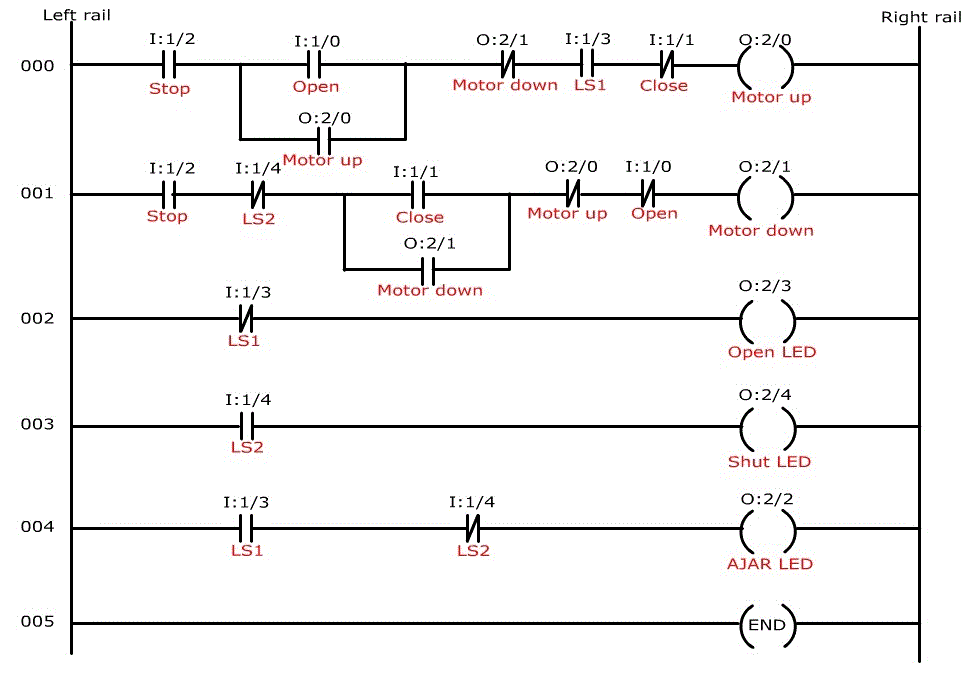
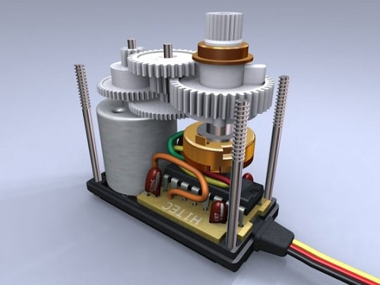

# Unidad 3: Sistemas de Control

 **Profesor:** Ing. Israel Chaves Arbaiza 

 **Curso**: Mecatrónica  

---
## Agenda

* Control en la mecatrónica
* Métodos y tipos de control
* Modelado de sistemas mecatrónicos
* Análisis de respuestas de sistemas 
* Principios de optimización 

Note: Prueba de notas para el speaker

---
## Control en la mecatrónica

----
## Control en la mecatrónica

* Típicamente, el sistema de control consta del sistema computacional que da órdenes a los actuadores
* En **Control Automático**, se conoce como *función de costo*, a la función que describe el rendimiento del sistema 
* Por ejemplo, medición del error, de la potencia consumida, desviación de un valor de referencia, etc. 
* Formalmente, el control debe diseñarse de manera que se cumpla el proceso deseado, minimizando la función de costo.

----
## Control en la mecatrónica

Para mejorar/diseñar un buen sistema, idealmente, se debe **optimizar** cada etapa del sistema, de manera que al unir las partes, luego de algunos ajustes. se cuenta con un subsistema optimizado.

----
## Control en la mecatrónica

Sin embargo, en la práctica, muchas veces no podemos optimizar cada etapa del sistema. Por lo tanto, se optimiza el control (hardware o software)

---

## Métodos y tipos de control

Formalmente, podemos hablar de 3 elementos clave en los tipos de control: 

1) **Control PID:** En un control a lazo cerrado, se mide el error entre un valor deseado y la salida del sistema. El control PID busca corregir y minimizar ese error. Para ello, utiliza 3 parámetros: **P (proporcional)**, ejecuta la acción para corregir el error, proporcionalmente al error, entre más grande sea, más grande P. 

**I (integral)**, considera el tiempo que ha permanecido presente el error. Entre más tiempo lleve el error presente en el sistema, más grande será I. Y por último, **D (derivativo)**, relacionado al cambio del error en el tiempo, es decir, entre más rápido cambie el error, mayor será D.  

----
## PID

----
## PID

----
## PID

---
## Métodos y tipos de control

2) **Computador Lógico Programable (PLC):** Es un sistema computacional sencillo, diseñado para ambientes de fábrica principalmente. 
Típicamente trabaja con señales digitales, tanto a las entradas como a las salidas. Existen múltiples lenguajes de programación para aplicarles el código, uno de los más comunes es la *programación en escalera*

----
## PLC

---
## Métodos y tipos de control

3) **Microprocesador/Microcontrolador:** Un cerebro computacional, ocupa dos partes principales, el **microprocesador** y el **microcontrolador**. El microprocesador se encarga de ejecutar las operaciones, y el microcontrolador, se encarga de la comunicación con las entradas, y salidas, y de darle las órdenes de cómo y cuándo actuar, al microprocesador. Contiene una memoria de almacenamiento más limitada. 
Se suelen utilizar cuando el sistema ó proceso es autónomo y requiere cierta portabilidad ó mobilidad, ó cuando el sistema es un prototipo. 

[//]: # (## Tipos: Electromecánicos)

[//]: # ()
[//]: # ()
[//]: # ()

[//]: # ()
[//]: # ()
[//]: # (<iframe width="580" height="500" src="https://i.pinimg.com/originals/93/a3/26/93a3265d5be4444bc24cde6ab8d6d522.gif" title="YouTube video player" frameborder="0" allow="accelerometer; autoplay; clipboard-write; encrypted-media; gyroscope; picture-in-picture" allowfullscreen></iframe>)

