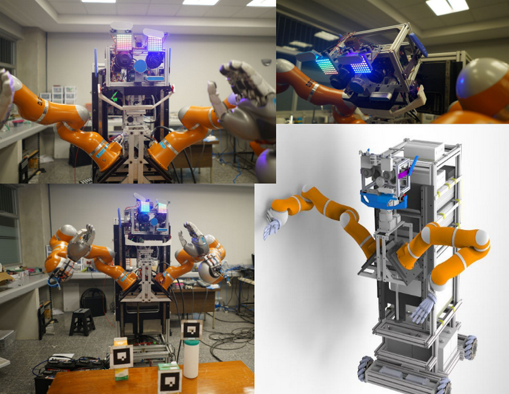
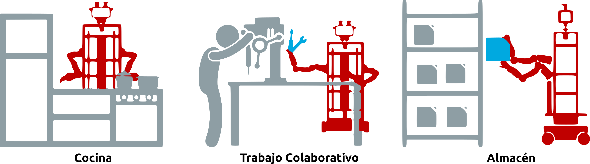
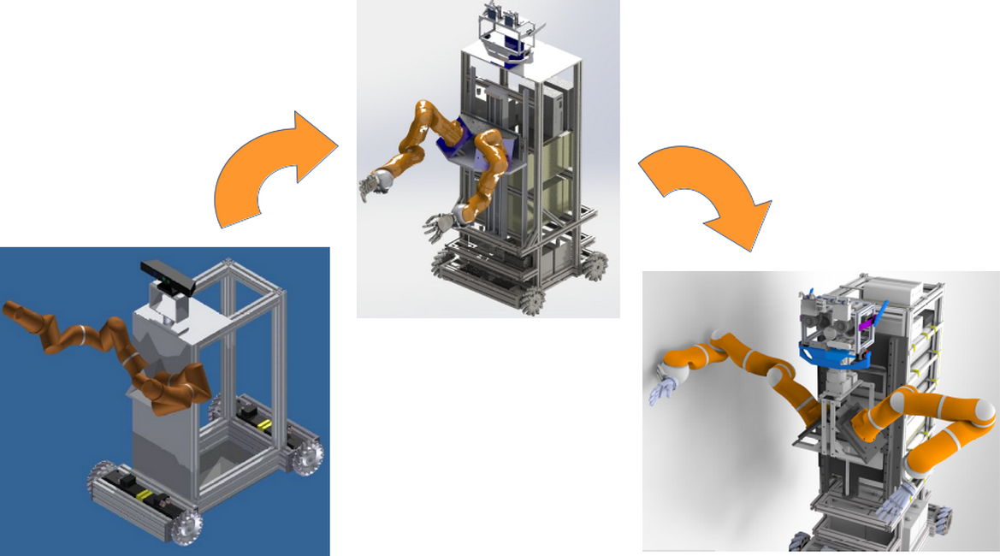
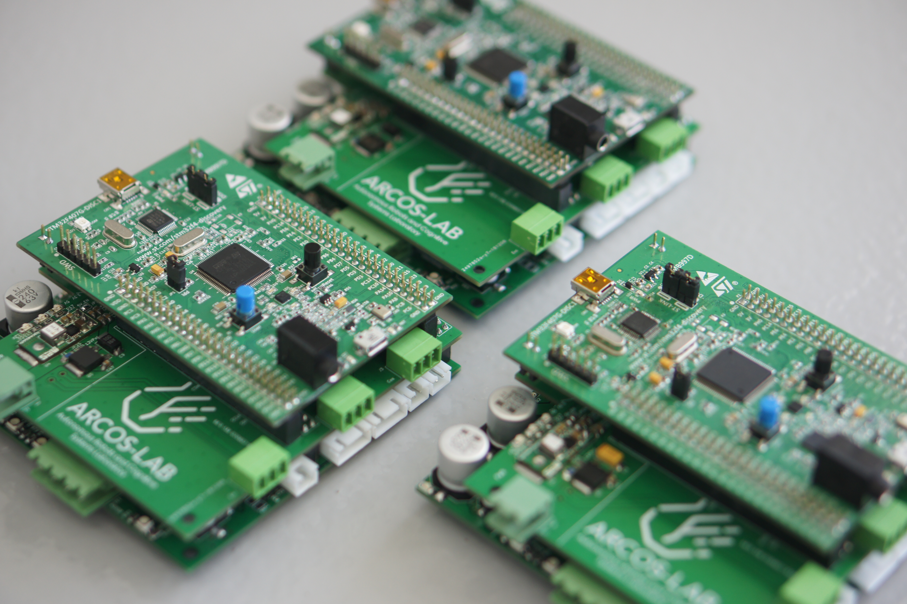
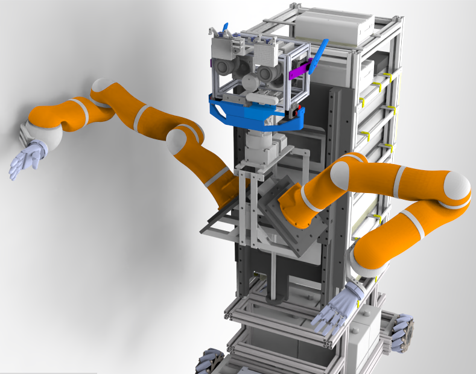
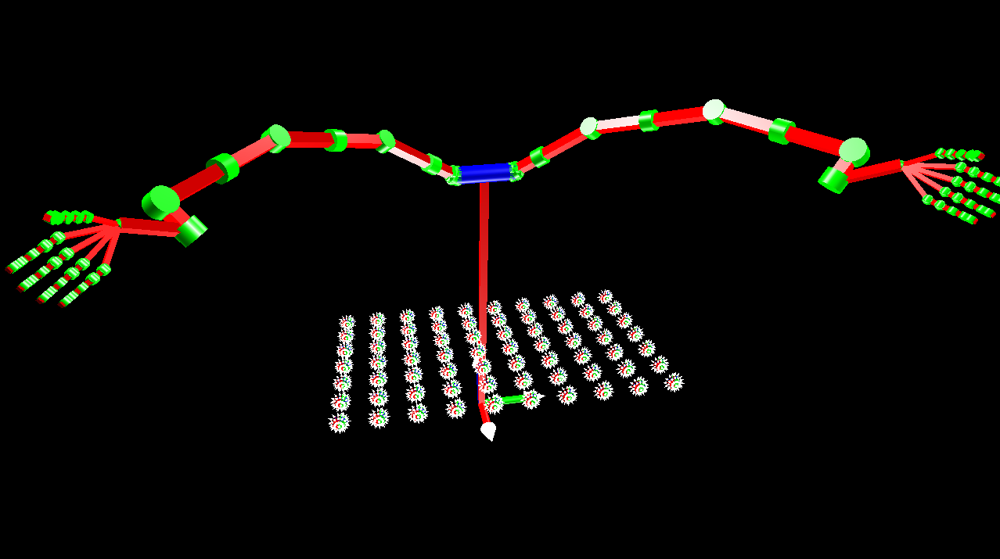
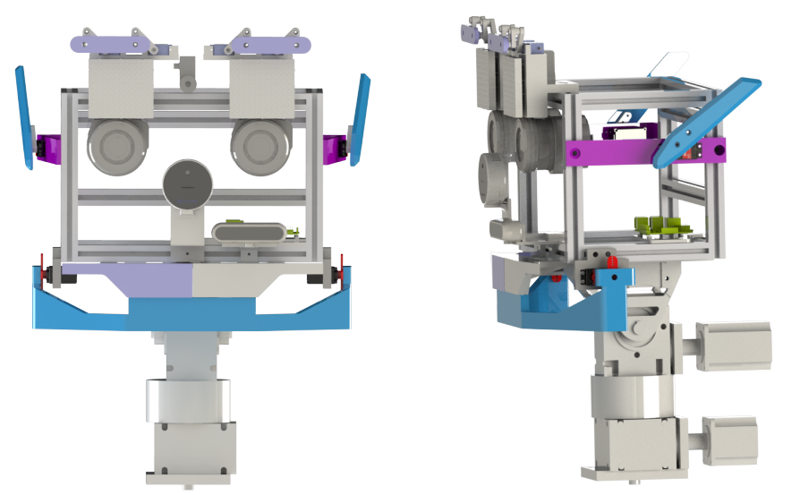
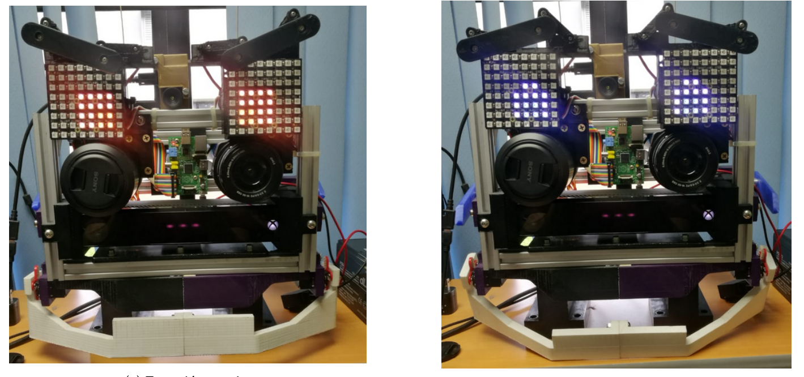
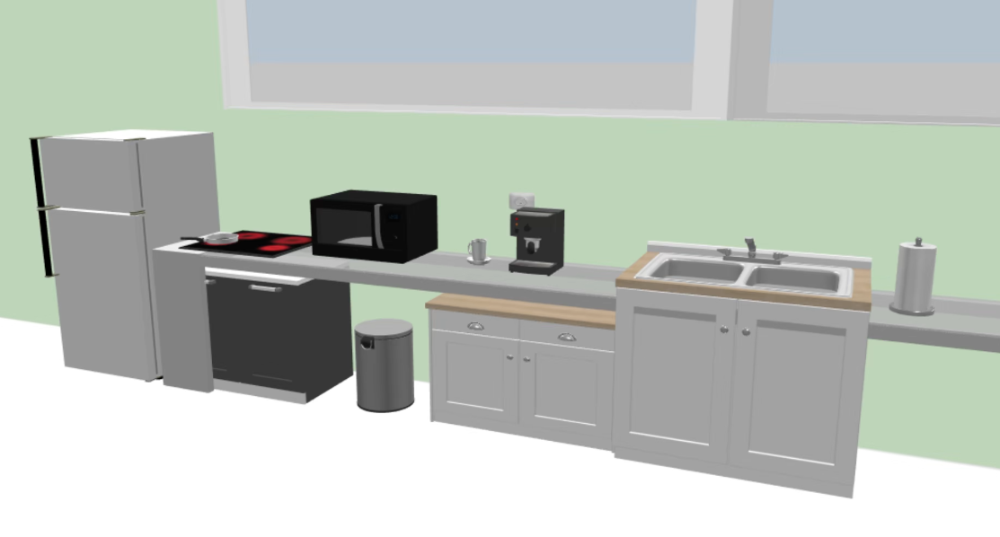

## Desarrollo del robot humanoide del ARCOS-Lab

 

 **Semana de Ingeniería y Arquitectura 2022** 

 **Expositor:** Ing. Israel Chaves Arbaiza, EIM   

 

---
## 

---
## Problemática

 

* Manipular múltiples y distintos objetos 
* Desempeñarse en entornos humanos
* Asistir a las personas en sus tareas cotidianas

---
## ¿Qué existe actualmente?

---
## Rollin' Justin robot de la DLR, Alemania

<iframe  width="800" height="400" src="images/justin.mp4" title="Video player" frameborder="0" allow="accelerometer; autoplay; clipboard-write; encrypted-media; gyroscope; picture-in-picture" allowfullscreen></iframe>

---
## Boxy robot del IAI, Alemania

<iframe  width="800" height="400" src="images/rosie.mp4" title="Video player" frameborder="0" allow="accelerometer; autoplay; clipboard-write; encrypted-media; gyroscope; picture-in-picture" allowfullscreen></iframe>

---
## Escenarios de nuestro robot

 
 

---
## Proceso de diseño del humanoide

---
## Plataforma móvil omnidireccional

* Ruedas *Mecanum* para reducir la fricción
* Contiene la circuitería de control de potencia del robot
* Articulación rotacional en el eje trasero
* Tarjetas de control propias con OpenCoRoCo 

---
## Torso 

* Sistema de tornillo sin fin para subir y bajar los "hombros" y la cabeza
* Diseño de los "hombros", obtenido mediante simulación
* Cuenta con 2 brazos KUKA LWR4+ y dos manos DLR HIT II
* Contiene las computadoras de cada subsistema del robot

---
## Brazos y manos

* Brazos desarrollados en conjunto entre la DLR y KUKA
* 7 grados de libertad c/u 
* Manos con 5 dedos c/u
* Tanto los brazos como las manos poseen **control suave**

---
## Control suave

<iframe  width="800" height="400" src="images/impedance_control.mp4" title="Video player" frameborder="0" allow="accelerometer; autoplay; clipboard-write; encrypted-media; gyroscope; picture-in-picture" allowfullscreen></iframe>

---
## Cuello y cabeza

* Cuello con sistema *pan-tilt*
* Cabeza con dos sensores *RealSense*
* Dos lentes profesionales *Sony*
* Una cámara térmica

---
## Cara emocional

* Dos matrices LED como "ojos"
* Orejas laterales y mandíbula
* Capacidad de mostrar distintas emociones
* Teoría del color relacionada a las emociones

---
## Resultados 

**Experimentos realizados con el sistema OMS del ARCOS-Lab, para la conferencia Humanoids-2020**

<iframe  width="800" height="400" src="images/pushing.mp4" title="Video player" frameborder="0" allow="accelerometer; autoplay; clipboard-write; encrypted-media; gyroscope; picture-in-picture" allowfullscreen></iframe>

---
## Trabajo actual y futuro

* **Control suave** a la base móvil 
* Integración de cada subsistema con la arquitectura de software
* Finalización de las conexiones eléctricas
* Creación de una carcasa a modo de piel
* Integración del robot con la **cocina inteligente**

---
## 

### Preguntas
 

* www.arcoslab.org / www.arcoslab.ucr.ac.cr
* https://www.facebook.com/ArcosLab

 
 

